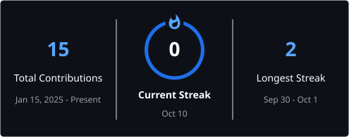
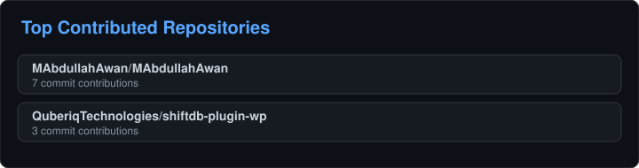

# Muhammad Abdullah

### Web Developer | API & Payment Integrations | CEO & Founder @ Quberiq Technologies

Building scalable web experiences, eCommerce solutions, APIs, integrations, and business-focused digital products.

---

## About Me

- **Currently working on:** Web Development, API Integrations & Payment Systems at ADB World, alongside building Quberiq Technologies.
- **Open to collaborating on:** WordPress, Shopify, Webflow, Framer, SaaS & Custom Web Development projects.
- **Exploring:** Scalable SaaS products, AI integrations & innovative software solutions.
- **Currently learning:** AI/ML, SaaS Architecture, Advanced APIs & Modern Software Development.
- **Ask me about:** WordPress, Shopify, Webflow, Framer, PHP, JavaScript, REST APIs & Payment Integrations.
- **What I bring:** A combination of technical development and business experience focused on solving real business problems.

 

  

 

### For Collaboration & Projects

Have a website, eCommerce, API integration, payment integration, SaaS, or custom development project?

 

### Quberiq Technologies

---

## Tech Stack

### Frontend & Web Development

### Backend, APIs & Software

### CMS, eCommerce & Website Builders

**WordPress · Shopify · Webflow · Framer · Custom Themes & Plugins**

### Databases & Cloud

### Tools, Automation & Design

**REST APIs · Payment Integrations · Playwright · SaaS · GitHub Actions**

---

## GitHub Stats

 

 

> **Primary Development Stack:** WordPress • Shopify • Webflow • Framer • PHP • JavaScript • REST APIs • Payment Integrations

---

## GitHub Trophies

  

---

## Top Contributed Repositories

  

---

## Developer Quote

  

---

**Build. Integrate. Optimize. Scale.**

